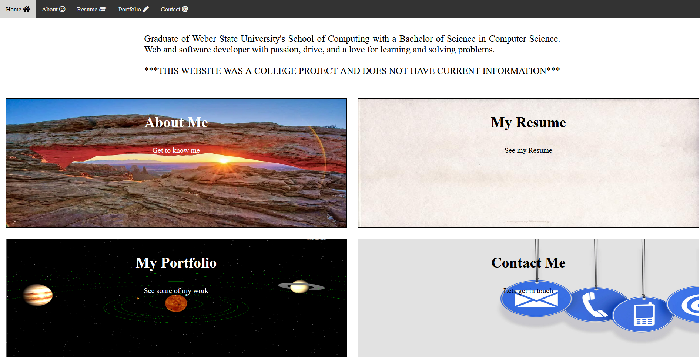

# Prototype Website
 Mock website I made for my web design course 
 
 

 # Description
 Midterm project for my CS 2350 course where we had to build a personal portfolio website. Utilized raw HTML, CSS, and Javascript as well as responsive design styling. 

 # Installation

 1. Clone the repository
 2. Open index.html in a web browser
